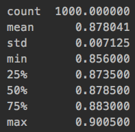
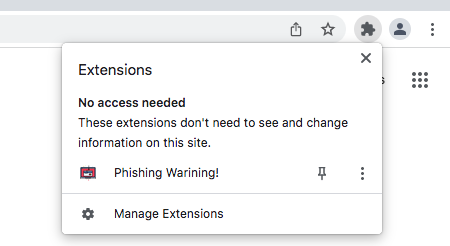
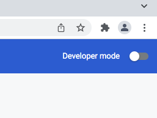
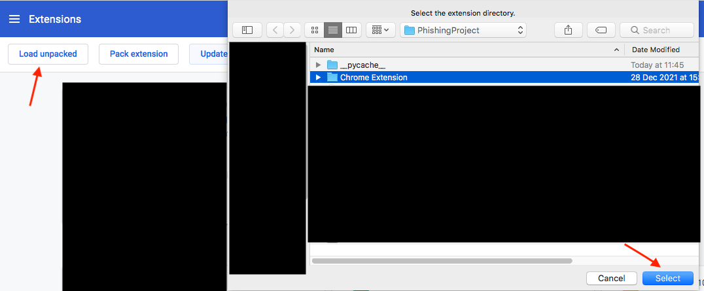

<div id="top"></div>

<!-- PROJECT SHIELDS -->
<!--
*** I'm using markdown "reference style" links for readability.
*** Reference links are enclosed in brackets [ ] instead of parentheses ( ).
*** See the bottom of this document for the declaration of the reference variables
*** for contributors-url, forks-url, etc. This is an optional, concise syntax you may use.
*** https://www.markdownguide.org/basic-syntax/#reference-style-links
-->
[![Contributors][contributors-shield]][contributors-url]
[![Forks][forks-shield]][forks-url]
[![Stargazers][stars-shield]][stars-url]
[![Issues][issues-shield]][issues-url]


<h3 align="center">Phishing Detector</h3>
<!-- PROJECT LOGO -->
<br />
<div align="center">
  <a href="https://github.com/aradcarmi/PhishingDetector">
    
  </a>


  <p align="center">
    <br />
    <a href="https://github.com/aradcarmi/PhishingDetector/issues">Report Bug</a>
    ·
    <a href="https://github.com/aradcarmi/PhishingDetector/issues">Request Feature</a>
  </p>
</div>


<!-- TABLE OF CONTENTS -->
<details>
  <summary>Table of Contents</summary>
  <ol>
    <li>
      <a href="#about-the-project">About The Project</a>
      <ul>
        <li><a href="#built-with">Built With</a></li>
        <li><a href="#description">Description</a></li>
        <li><a href="#features">Features</a></li>
      </ul>
    </li>
    <li>
      <a href="#getting-started">Getting Started</a>
      <ul>
        <li><a href="#prerequisites">Prerequisites</a></li>
        <li><a href="#installation">Installation</a></li>
      </ul>
    </li>
    <li><a href="#run">Run</a></li>
    <li><a href="#contributing">Contributing</a></li>
    <li><a href="#contact">Contact</a></li>
  </ol>
</details>

<!-- ABOUT THE PROJECT -->
## About The Project

This project aims to detect and alert the user from phishing webpages.

[![Product Name Screen Shot][product-screenshot]](https://example.com)

<p align="right">(<a href="#top">back to top</a>)</p>


### Built With

* [Chrome Extension](https://developer.chrome.com/docs/extensions/)
* [Sklearn.py](https://scikit-learn.org/stable/)
* [Pandas.py](https://pandas.pydata.org/)
* [Express.js](https://expressjs.com/)
* [Dataset](https://www.kaggle.com/shashwatwork/phishing-dataset-for-machine-learning)

<p align="right">(<a href="#top">back to top</a>)</p>

### Description

* The purpose of the project is to locate phishing activity and alert the user using the chrome extension tool.
* The classification of the site is based on a model of decision tree.
* The model is traind on 10,000 urls when half are phishing sites and half are not.
* The accuracy of the machine is 88%:

     <a href="https://github.com/aradcarmi/PhishingDetector">
    
    </a>
 
<p align="right">(<a href="#top">back to top</a>)</p>


### Features

  * Feature value can be:
    * Number [0,+inf)
    * Custom [-1,0,1] (Error/No/Yes)
  
  ---The features shown below were selected to represent the data set---
  
  <table>
  <tr>
    <th>Feature Name</th>
    <th>Value</th>
    <th>Description</th>
  </tr>
  <tr>
    <td>NumDots</td>
    <td>Number</td>
    <td>Count the number of '.' in the url</td>
  </tr>
  <tr>
    <td>SubdomainLevel</td>
    <td>Number</td>
    <td>Count the number of Subdomain in the url</td>
  </tr>
   <tr>
    <td>PathLevel</td>
    <td>Number</td>
    <td>Count the number of '/' in the path of the url</td>
  </tr>
  <tr>
    <td>UrlLength</td>
    <td>Number</td>
    <td>Url length</td>
  </tr>
  <tr>
    <td>NumDash</td>
    <td>Number</td>
    <td>Count the number of '-' in the url</td>
  </tr>
  <tr>
    <td>AtSymbol</td>
    <td>Custom</td>
    <td>Check if url have '@' symbol</td>
  </tr>
  <tr>
    <td>TildeSymbol</td>
    <td>Custom</td>
    <td>Check if url have '~' symbol</td>
  </tr>
  <tr>
    <td>NoHttps</td>
    <td>Custom</td>
    <td>Check if url start with "https"</td>
  </tr>
  <tr>
    <td>PopUpWindow</td>
    <td>Custom</td>
    <td>Check if url have popup window</td>
  </tr>
  <tr>
    <td>DomainInSubdomains</td>
    <td>Custom</td>
    <td>Check if url have domain in subdomains</td>
  </tr>
  <tr>
    <td>QueryLength</td>
    <td>Number</td>
    <td>Query length</td>
  </tr>
  <tr>
    <td>NumQueryComponents</td>
    <td>Number</td>
    <td>Count the number of query components (The number of '=' after '?' in the url)</td>
  </tr>
  <tr>
    <td>NumSensitiveWords</td>
    <td>Number</td>
    <td>Count the number of sensitive words (such as "secure", "account", "webscr", "login","ebayisapi", "signin", "banking", "confirm",...etc)</td>
  </tr>
</table>

<p align="right">(<a href="#top">back to top</a>)</p>


<!-- GETTING STARTED -->
## Getting Started

This is an example of how you may give instructions on setting up your project locally.
To get a local copy up and running follow these simple example steps.

### Prerequisites
  * Download & Install Python  (Version 3.7 or later) https://www.python.org/downloads/
  * Download & Install Pip https://pip.pypa.io/en/stable/cli/pip_install/
  * Download & Install Node.js (Version 13 or later)  https://nodejs.org/en/
  * Download & Install Npm (Version 6 or later)  https://docs.npmjs.com/about-npm
  
### Installation
1. Clone the repo
   ```sh
   git clone https://github.com/AradCarmi/PhishingDetector.git
   ```
2. Open "Model.py" ,"Main.py", "Features.py":

    pip install all imports. (here some [guidance](https://www.youtube.com/watch?v=sIan8TOz0GA))
3. Open ./Main.py
4. Add the absolute path(under Additives folder: dataset suffix .csv,Model suffix .sav):
  ``` sh 
  dataSetPath = "<Absoulte Path>"
  whiteListPath = "<Absoulte Path>"
  modelPath = "<Absoulte Path>"
  ```
5. Run in Chrome Extension folder:
  ```sh
   npm install express
   ```
6. Open your web browser and click on the extension icon and perss on "Manage Extensions"
   
   <a href="https://github.com/aradcarmi/PhishingDetector">
    
    </a>
7. Toggle the "Developer Mode" button on the right side of the webpage

  <a href="https://github.com/aradcarmi/PhishingDetector">
    
    </a>  
8. Pick Load unpack option on the left side of the webpage and upload "./Chrome Extension" folder
  
  <a href="https://github.com/aradcarmi/PhishingDetector">
    
    </a>
    
<p align="right">(<a href="#top">back to top</a>)</p>

### Run
1. Open Terminal/CMD.
2. Navigate to the "Chrome Extension" folder.
3. Run The following command:
``` sh 
  node host.js <Your absolute path to project folder>
  ```
4. Toggle the extension in yours "Manage Extensions" tab and the extension will work and will alert you for phishing sites.

<p align="right">(<a href="#top">back to top</a>)</p>


<!-- CONTRIBUTING -->
## Contributing

Contributions are what make the open source community such an amazing place to learn, inspire, and create. Any contributions you make are **greatly appreciated**.

If you have a suggestion that would make this better, please fork the repo and create a pull request. You can also simply open an issue with the tag "enhancement".
Don't forget to give the project a star! Thanks again!

1. Fork the Project
2. Create your Feature Branch (`git checkout -b feature/AmazingFeature`)
3. Commit your Changes (`git commit -m 'Add some AmazingFeature'`)
4. Push to the Branch (`git push origin feature/AmazingFeature`)
5. Open a Pull Request

<p align="right">(<a href="#top">back to top</a>)</p>


<!-- CONTACT -->
## Contact
hareldv@post.bgu.ac.il

aradca@post.bgu.ac.il

Project Link: [https://github.com/AradCarmi/PhishingDetector](https://github.com/AradCarmi/PhishingDetector)

<p align="right">(<a href="#top">back to top</a>)</p>


<!-- MARKDOWN LINKS & IMAGES -->
<!-- https://www.markdownguide.org/basic-syntax/#reference-style-links -->
[contributors-shield]: https://img.shields.io/github/contributors/aradcarmi/PhishingDetector.svg?style=for-the-badge
[contributors-url]: https://github.com/aradcarmi/PhishingDetector/graphs/contributors
[forks-shield]: https://img.shields.io/github/forks/aradcarmi/PhishingDetector.svg?style=for-the-badge
[forks-url]: https://github.com/aradcarmi/PhishingDetector/network/members
[stars-shield]: https://img.shields.io/github/stars/aradcarmi/PhishingDetector.svg?style=for-the-badge
[stars-url]: https://github.com/aradcarmi/PhishingDetector/stargazers
[issues-shield]: https://img.shields.io/github/issues/aradcarmi/PhishingDetector.svg?style=for-the-badge
[issues-url]: https://github.com/aradcarmi/PhishingDetector/issues
[product-screenshot]: images/screenshot.png
